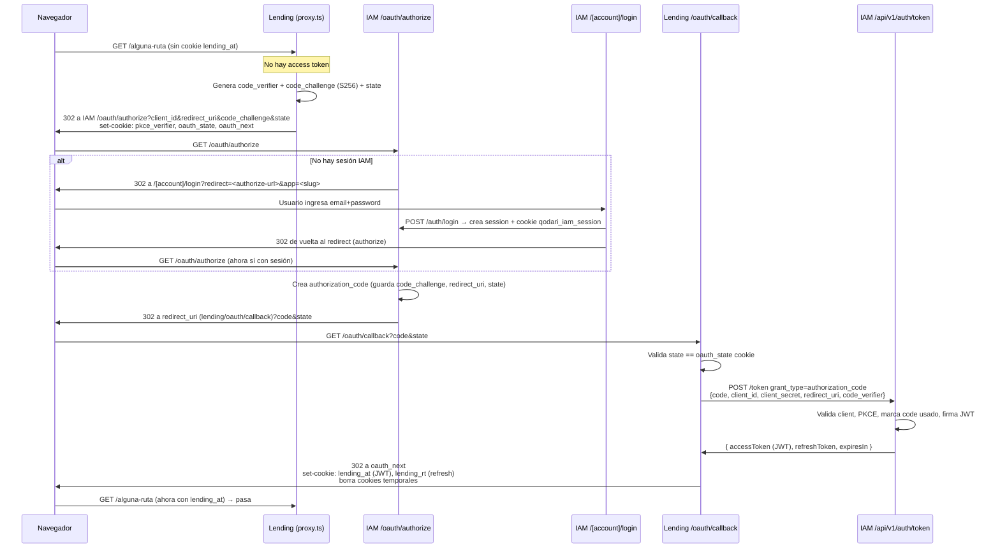

# Qodari IAM — Workflow completo (login, tokens, permisos, redirects)

> Documento de referencia del proceso de autenticación y autorización de **Qodari IAM**
> y de cómo lo consume una aplicación cliente (ejemplo real: **qodari-lending**).
>
> Cubre las dos formas de autenticación:
> 1. **Usuarios** vía OAuth 2.0 Authorization Code + PKCE (SSO).
> 2. **Máquina a máquina (M2M)** vía Client Credentials.

---

## 1. Actores y conceptos

| Concepto | Descripción | Tabla |
|---|---|---|
| **Account** | Tenant / organización. Todo cuelga de aquí. Tiene `slug` único. | `accounts` |
| **Application** | Una app OAuth cliente dentro de una account (ej. "lending"). Tiene `clientId`, `clientSecret`, `clientJwtSecret`, `callbackUrls`, `logoutUrl`. | `applications` |
| **User** | Usuario final, pertenece a una account. Login con email + password (Argon2). | `users` |
| **Role** | Rol **scoped por aplicación** (`accountId` + `applicationId` + `slug`). | `roles` |
| **Permission** | Permiso `resource:action` scoped por aplicación. | `permissions` |
| **API Client** | Credencial M2M (client_credentials). Tiene roles asignados. | `api_clients` |
| **Authorization Code** | Código OAuth de un solo uso (con soporte PKCE). | `authorization_codes` |
| **Refresh Token** | Token de refresco con rotación y detección de reuso por `familyId`. | `refresh_tokens` |
| **Session** | Sesión de navegador **en el portal IAM** (cookie httpOnly). | `sessions` |
| **MFA Pending** | Registro temporal de código MFA por email. | `mfa_pending` |
| **Audit Log** | Bitácora de acciones (actor user o api_client). | `audit_logs` |

### Jerarquía de datos

```
Account (tenant)
├── Applications (clientes OAuth)
│   ├── Roles          (scoped por app)
│   │   └── RolePermissions ─── Permissions (resource:action, scoped por app)
│   ├── AuthorizationCodes
│   └── RefreshTokens
├── Users
│   └── UserRoles ─── Roles
├── ApiClients
│   └── ApiClientRoles ─── Roles
└── Sessions, AuditLogs, MfaPending
```

**Punto clave:** roles y permisos **siempre están asociados a una aplicación concreta**. Un
usuario puede tener roles distintos en `lending` y en el portal admin del IAM. El access token
que emite el IAM lleva **solo** los roles/permisos de la app para la que se emitió.

---

## 2. Dos "planos" de autenticación

El IAM tiene **dos superficies** que conviene no confundir:

### A) Portal propio del IAM — **Session Cookie**
El propio IAM es una app Next.js con su panel de administración (`/[accountSlug]/admin/...`).
Cuando un usuario hace login en el portal IAM se crea una **fila en `sessions`** y se setea una
cookie httpOnly `qodari_iam_session` con el `session.id`. La API admin del IAM se protege leyendo
esa cookie (ver [`getAuthContextFromRequest`](../src/server/utils/auth-context.ts)).

### B) Apps cliente (lending, etc.) — **JWT Access Token**
Las apps externas **no** usan la sesión del IAM. Obtienen un **JWT** vía OAuth y lo guardan en su
propia cookie (`lending_at`). Cada request a la app cliente se valida verificando el JWT — el IAM
**no** se consulta en cada request (validación stateless).

> La cookie de sesión del IAM y el access token JWT de la app son cosas **separadas**.
> El puente entre ambos es el endpoint `/oauth/authorize`.

---

## 3. Flujo OAuth completo (usuario en lending → IAM → lending)

Este es el flujo cuando un usuario abre `qodari-lending` sin sesión.



### Paso a paso

1. **Proxy / middleware de lending** ([`src/proxy.ts`](../../qodari-lending/src/proxy.ts) → [`createIamProxy`](../../qodari-lending/src/iam/libs/proxy.ts)):
   - Si la ruta es pública o ya hay cookie de access token → deja pasar.
   - Si no hay token → genera **PKCE** (`code_verifier` aleatorio + `code_challenge` = SHA-256 base64url) y un `state`, los guarda en cookies httpOnly temporales (`pkce_verifier`, `oauth_state`, `oauth_next`) y redirige a `IAM /oauth/authorize`.

2. **IAM `/oauth/authorize`** ([route](../src/app/oauth/authorize/route.ts)):
   - Valida `client_id` → busca `application` activa.
   - Valida `redirect_uri` contra `application.callbackUrls` (si no viene, usa el primero de la lista).
   - Solo soporta `response_type=code`.
   - **Si no hay sesión IAM** (`qodari_iam_session`): redirige a `/[accountSlug]/login?redirect=<authorize-url>&app=<slug>`.
   - **Si hay sesión**: crea un `authorization_code` (guarda `code_challenge`, `codeChallengeMethod`, `redirectUri`, `state`, `scope`, `expiresAt = now + authCodeExp`) y redirige de vuelta al `redirect_uri` del cliente con `?code=...&state=...`.

3. **Login en el portal IAM** (solo si no había sesión): `POST /auth/login` valida credenciales y crea la sesión + cookie. Luego el frontend redirige de vuelta a la URL `redirect` (que es el `/oauth/authorize` original), y ahora sí se emite el code.

4. **Callback de lending** ([route](../../qodari-lending/src/app/oauth/callback/route.ts) → [`createIamCallbackHandler`](../../qodari-lending/src/iam/libs/callback.ts)):
   - Valida `state` recibido == `oauth_state` cookie (protección CSRF).
   - Llama a `IAM /token` con `grant_type=authorization_code` + `code` + `client_secret` + `code_verifier`.
   - Recibe el JWT y lo guarda en cookies httpOnly: `lending_at` (access, `maxAge = expiresIn`) y `lending_rt` (refresh, `maxAge` ~15 días).
   - Borra las cookies temporales y redirige a `oauth_next`.

---

## 4. Endpoint de tokens `/auth/token` (los 3 grant types)

Implementado en [`handlers/auth.ts › oauthToken`](../src/server/api/handlers/auth.ts). Un solo
endpoint que ramifica por `grant_type`:

### 4.1 `authorization_code`
1. Busca la `application` por `client_id`; verifica que esté activa.
2. **Valida `client_secret`** si la app es `confidential` (timing-safe compare). Las apps `public` (SPA/móvil) no lo requieren.
3. Busca el `authorization_code`; valida que sea de esa app, **no usado** y **no expirado**.
4. Si viene `redirect_uri`, debe coincidir con el guardado en el code.
5. **PKCE**: obligatorio para clientes `public`. Si el code tiene `code_challenge` con método `S256`, exige `code_verifier` y compara `SHA256(code_verifier) == code_challenge`.
6. Marca el code como **usado** (`used=true`, `usedAt`).
7. Calcula roles/permisos del usuario para esa app ([`getUserRolesAndPermissions`](../src/server/utils/get-user-roles-and-permissions.ts)) y firma el **access token JWT**.
8. Crea un **refresh token** nuevo (con `familyId` nuevo).
9. Devuelve `{ accessToken, refreshToken, tokenType: 'Bearer', expiresIn, scope }`.

### 4.2 `refresh_token` (rotación + detección de reuso)
1. Valida app + `client_secret`.
2. Busca el refresh token por **hash** (`SHA-256`) + `applicationId`.
3. **Detección de reuso**: si el token encontrado ya está `revoked` → se asume robo y se **revoca toda la familia** (`familyId`) con motivo `REUSE_DETECTED`, y se rechaza (401).
4. Si expiró → 401.
5. **Rotación** (en transacción): marca el token viejo como `revoked` con motivo `ROTATED`, e inserta uno nuevo con el **mismo `familyId`**.
6. Firma un access token nuevo y devuelve `{ accessToken, refreshToken (nuevo), expiresIn }`.

### 4.3 `client_credentials` (M2M)
1. Busca el `api_client` por `client_id`; verifica que esté activo.
2. Verifica `client_secret` contra `clientSecretHash` (**Argon2**).
3. Busca la `application` destino por `app_slug` dentro de la misma account.
4. Calcula permisos del API client para esa app ([`getApiClientRolesAndPermissions`](../src/server/utils/get-api-client-roles-and-permissions.ts)). Si **no tiene permisos** → 403.
5. Firma un access token con `grantType: 'client_credentials'`, `sub = apiClient.id`.
6. Actualiza `lastUsedAt`. **No emite refresh token** (los M2M piden uno nuevo cuando expira).

---

## 5. Estructura del Access Token (JWT)

Firmado en [`utils/jwt.ts`](../src/server/utils/jwt.ts) con **HS256**.

```jsonc
{
  "sub": "<userId | apiClientId>",
  "accountId": "<uuid>",
  "appId": "<application.id>",
  "roles": ["admin", "analyst"],           // slugs (solo tokens de usuario)
  "permissions": ["loan:read", "loan:create"], // "resource:action"
  "grantType": "client_credentials",       // SOLO en tokens M2M
  "user": {                                 // solo tokens de usuario
    "email": "...", "firstName": "...", "lastName": "...", "isAdmin": false
  },
  "iss": "<IAM_ISSUER>",
  "aud": "<application.clientId>",
  "iat": 1700000000,
  "exp": 1700000900
}
```

### ⚠️ Detalle crítico: el secreto de firma es **por aplicación**

El IAM firma cada token con **`application.clientJwtSecret`** (columna en la tabla `applications`),
**no** con un secreto global. Por eso:

- Cada app cliente (lending) debe configurar en su entorno **`IAM_JWT_SECRET` = el `clientJwtSecret`
  de su propia aplicación en el IAM**. Con eso verifica los tokens localmente ([lending `verify-access-token.ts`](../../qodari-lending/src/iam/utils/verify-access-token.ts)) sin llamar al IAM.
- El `aud` del token es el `clientId` de la app → sirve para validar destino.

---

## 6. Validación de permisos (RBAC)

El modelo es **RBAC scoped por aplicación**: `User → UserRoles → Roles → RolePermissions →
Permissions`, donde cada permiso es `resource:action`.

### En rutas ts-rest: metadata en el contrato

Cada endpoint declara en su contrato:

```ts
metadata: {
  auth: 'required',                 // o 'public'
  permissionKey: { resourceKey: 'loan', actionKey: 'read' }, // → "loan:read"
} satisfies TsRestMetaData,
```

### En el IAM (API admin) — sesión + permiso

[`require-permission.ts`](../src/server/utils/require-permission.ts) → `requireAdminPermission`:
- Resuelve el contexto vía cookie de sesión (o Bearer M2M) con `getUnifiedAuthContext`.
- Si `metadata.auth === 'public'` → pasa.
- Si el usuario es **`isAdmin`** → pasa (bypass total).
- Si no, exige que `ctx.permissions` incluya `resourceKey:actionKey`; si no → **403**.

### En lending (app cliente) — JWT + permiso

[`require-permission.ts`](../../qodari-lending/src/server/utils/require-permission.ts) →
`getAuthContextAndValidatePermission`, llamado **dentro de cada handler**:

```ts
const session = await getAuthContextAndValidatePermission(request, appRoute.metadata);
```

- `getUnifiedAuthContext` resuelve el contexto: **Bearer token primero**, si no cookie `lending_at`.
- Verifica el JWT con `IAM_JWT_SECRET` (stateless, sin llamar al IAM).
- Misma lógica: `public` pasa, `isAdmin` pasa, si no compara el `permissionKey` contra los
  `permissions` del token. 403 si falta.

**Los permisos viajan dentro del JWT**, así que la app cliente no necesita consultar el IAM para
autorizar — solo verificar la firma. La contrapartida: cambios de permisos en el IAM se reflejan
en la app **cuando el usuario obtiene un token nuevo** (login o refresh).

---

## 7. Refresh automático en el cliente (401 → refresh → retry)

En el frontend, [`clients/api.ts`](../../qodari-lending/src/clients/api.ts) envuelve el fetch de
ts-rest:

1. Cada request va con `credentials: 'include'` (envía la cookie `lending_at`).
2. Si la respuesta es **401** en el navegador → llama a `POST /api/auth/refresh`.
3. [`/api/auth/refresh`](../../qodari-lending/src/app/api/auth/refresh/route.ts) → [`createIamRefreshHandler`](../../qodari-lending/src/iam/libs/refresh.ts) usa la cookie `lending_rt` para pedir un token nuevo a `IAM /token` (`grant_type=refresh_token`) y **re-setea las cookies** (access rotado + refresh rotado).
4. Si el refresh tuvo éxito → **reintenta** el request original. Si falló → borra cookies y redirige a `/` (que dispara de nuevo el proxy → IAM login).
5. Usa un lock (`isRefreshing` + `refreshPromise`) para que múltiples 401 concurrentes disparen **un solo** refresh.

En el **servidor** (RSC / route handlers), en lugar de cookie se lee el token con `next/headers` y
se pasa como `Authorization: Bearer` al llamar la API.

---

## 8. MFA (opcional por aplicación)

Si `application.mfaEnabled === true`, el `POST /auth/login` **no** crea sesión inmediatamente:

1. Genera un código, lo hashea y crea un registro en `mfa_pending`; envía el código por email.
2. Responde `{ mfaRequired: true, mfaToken: <mfaPending.id>, maskedEmail }`.
3. El frontend redirige a `/[accountSlug]/mfa`.
4. `POST /auth/mfa/verify` valida `mfaToken` + `code` (+ que coincidan `accountSlug`/`appSlug`),
   controla expiración e **intentos máximos** (`MFA_CONFIG.MAX_ATTEMPTS`), borra el `mfa_pending` y
   **crea la sesión**.
5. `POST /auth/mfa/resend` regenera código (rate-limited).

---

## 9. Recuperación de contraseña

- `POST /auth/forgot-password`: siempre responde 200 con mensaje genérico (**no revela** si el email
  existe). Si existe, genera token (`SHA-256` guardado en `users.passwordResetToken`, TTL 1h) y envía
  email con `/[accountSlug]/reset-password?token=...`.
- `POST /auth/reset-password`: valida token no expirado, actualiza el hash, **borra todas las
  sesiones** del usuario y **revoca todos sus refresh tokens** (`PASSWORD_RESET`).
- `POST /auth/change-password` (autenticado): valida password actual y actualiza.

---

## 10. Logout

Dos mecanismos:

- **Portal IAM** — `POST /auth/logout`: borra la fila `sessions` y limpia la cookie `qodari_iam_session`.
- **RP-Initiated Logout (OIDC)** — [`GET /oauth/logout`](../src/app/oauth/logout/route.ts): recibe
  `client_id` (+ opcional `post_logout_redirect_uri` que debe estar en `application.logoutUrl`),
  borra la sesión, limpia la cookie y redirige a la URL de logout configurada.

> Nota: el logout borra la **sesión del IAM**. Las cookies de access/refresh que viven en la app
> cliente (`lending_at`, `lending_rt`) se limpian del lado de la app (o expiran). Para un logout
> total, la app cliente debe borrar sus cookies y además llamar a `/oauth/logout` o revocar el
> refresh token (`POST /auth/revoke`, RFC 7009).

---

## 11. Rate limiting y protección de cuentas

- **Rate limit** (tabla `rate_limits`) por IP y por email/token en: login (5/email, 20/IP por 5 min),
  forgot-password, reset-password, change-password, mfa verify/resend, revoke.
- **Bloqueo de cuenta**: tras `MAX_FAILED_LOGIN_ATTEMPTS = 5` fallos, `users.lockedUntil` bloquea la
  cuenta 1 hora. Se resetea al primer login exitoso o cuando expira el lock.
- `authorization_code` es de **un solo uso** y con expiración corta (`authCodeExp`, default 300s).
- Refresh tokens: rotación + detección de reuso (revoca familia completa).

---

## 12. Variables de entorno relevantes

### IAM
| Variable | Uso |
|---|---|
| `IAM_ISSUER` | `iss` de los JWT emitidos. |
| `IAM_APP_SLUG` | Slug de la app "portal admin" del propio IAM (usado por `requireAdminPermission`). |
| `IAM_DEFAULT_ACCOUNT_SLUG` | Account por defecto. |
| `IAM_JWT_SECRET` | Secreto JWT del propio portal IAM (los tokens de apps usan `application.clientJwtSecret`). |
| `NEXT_PUBLIC_APP_URL` | Base URL del IAM (para construir redirects de authorize/login). |
| `DATABASE_URL`, `RESEND_*`, `DO_SPACES_*` | DB, emails, storage. |

### App cliente (lending)
| Variable | Uso |
|---|---|
| `IAM_BASE_URL` | Base URL del IAM. |
| `IAM_TOKEN_URL` | Endpoint `/api/v1/auth/token`. |
| `IAM_CLIENT_ID` / `IAM_CLIENT_SECRET` | Credenciales OAuth de **esta app** (flujo de usuario). |
| `IAM_REDIRECT_URI` | Callback registrado en `application.callbackUrls`. |
| `IAM_JWT_SECRET` | **= `clientJwtSecret` de esta app en el IAM.** Verifica los JWT localmente. |
| `IAM_M2M_CLIENT_ID` / `IAM_M2M_CLIENT_SECRET` | Credenciales del **API Client** (flujo M2M). |
| `IAM_SLUG` / `IAM_APP_SLUG` | Slug de la app destino para pedir tokens M2M. |
| `ACCESS_TOKEN_NAME` / `REFRESH_TOKEN_NAME` | Nombres de cookie (`lending_at` / `lending_rt`). |

---

## 13. M2M — cómo lending llama al IAM (server-to-server)

[`iam-m2m-client.ts`](../../qodari-lending/src/iam/clients/iam-m2m-client.ts) es un singleton que:

1. Pide un token con `grant_type=client_credentials` (`IAM_M2M_CLIENT_ID/SECRET` + `app_slug`).
2. **Cachea el token en memoria** y lo renueva 60s antes de expirar.
3. Llama endpoints del IAM (`/api/v1/audit`, `/api/v1/users`) con `Authorization: Bearer`.

Se usa, por ejemplo, para escribir **audit logs** en el IAM y para **listar/consultar usuarios**
del IAM desde lending. Del lado del IAM, esos endpoints se validan con `getUnifiedAuthContext` →
`getM2MAuthContext`, que decodifica el token, ubica la app por `appId`, verifica la firma con el
`clientJwtSecret` de esa app y exige `grantType === 'client_credentials'`.

---

## 14. Resumen de endpoints del IAM

| Método | Ruta | Auth | Descripción |
|---|---|---|---|
| POST | `/api/v1/auth/login` | pública | Login email+password (portal IAM). Puede exigir MFA. |
| GET | `/api/v1/auth/me` | sesión | Usuario + apps visibles + (opcional) roles/permisos de una app. |
| POST | `/api/v1/auth/logout` | sesión | Cierra sesión del portal IAM. |
| POST | `/api/v1/auth/token` | cliente | `authorization_code` \| `refresh_token` \| `client_credentials`. |
| POST | `/api/v1/auth/revoke` | cliente | Revoca refresh token (RFC 7009). |
| POST | `/api/v1/auth/forgot-password` | pública | Solicita email de reseteo. |
| POST | `/api/v1/auth/reset-password` | pública | Resetea con token. |
| POST | `/api/v1/auth/change-password` | sesión | Cambia password autenticado. |
| POST | `/api/v1/auth/mfa/verify` | pública | Verifica código MFA y crea sesión. |
| POST | `/api/v1/auth/mfa/resend` | pública | Reenvía código MFA. |
| GET | `/api/v1/auth/branding` | pública | Branding (logos) para pantallas de auth. |
| GET | `/oauth/authorize` | sesión | Inicia Authorization Code (redirige a login o emite code). |
| GET | `/oauth/logout` | — | RP-Initiated Logout (OIDC). |

---

## 15. Notas / posibles mejoras observadas

- El rate limit de `/auth/token` está **comentado** en el handler (`oauthToken`). Considerar
  reactivarlo.
- En `/oauth/logout` la condición de validación de `post_logout_redirect_uri` usa `includes(...)`
  para **rechazar** cuando coincide — conviene revisar la lógica (parece invertida respecto al
  comentario "must match").
- `getM2MAuthContext` decodifica el payload **sin verificar** para obtener `appId` antes de verificar
  la firma. Es un patrón común (necesita el `appId` para elegir el secreto), pero conviene tenerlo
  presente: nada del payload es de fiar hasta el paso de verificación.
- Los permisos viajan en el JWT ⇒ revocar/cambiar permisos no tiene efecto inmediato hasta el
  siguiente refresh/login. Si se necesita revocación inmediata, habría que introducir introspección
  o TTLs muy cortos.
</content>
</invoke>
